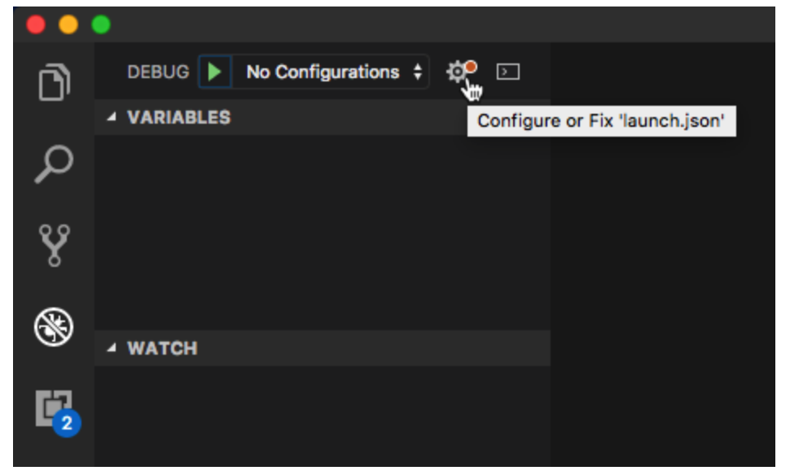

## 预安装
1. 安装webfreak插件
    * 在VSCode的`cmd+p`弹出的框中运行`ext install webfreak.debug`
    * `ln -s /Applications/Xcode.app/Contents/Developer/usr/bin/lldb-mi /usr/local/bin/lldb-mi`
## 配置
1.  打开VSCode的调试界面
    
2.  进入lanuch.json的界面，将如下配置加入，`"configurations"`中：
    ```
    {
            "name": "(lldb) jd_resume_match_backend",
            "type": "cppdbg",
            "request": "launch",
            "program": "${workspaceFolder}/bazel-bin/matching/mapi/jd_resume_match_backend",
            "args": ["-conf_path", "matching/jobrec/jobrec.json"],
            "stopAtEntry": false,
            "cwd": "${workspaceFolder}",
            "environment": [],
            "externalConsole": true,
            "miDebuggerPath": "/usr/local/bin/lldb-mi",
            "setupCommands": [

                { "text": "-enable-pretty-printing", "description": "enable pretty printing", "ignoreFailures": true },

                { "text": "handle SIGPIPE nostop noprint pass", "description": "ignore SIGPIPE", "ignoreFailures": true }  
            ],
            "MIMode": "lldb",  
            // "preLaunchTask": "bazel build -c dbg matching/mapi:jd_resume_match_backend",
        },
    ```
3. 其中
    * `"program": "${workspaceFolder}/bazel-bin/matching/mapi/jd_resume_match_backend"`修改为要调试的程序,
    * `"args": ["-conf_path", "matching/jobrec/jobrec.json"],`修改为相应的程序参数
4. 编译程序
    `bazel build -c dbg matching/mapi:jd_resume_match_backend`,注意加入`-c dbg`选项

## Reference
1. [官方文档--debug](https://code.visualstudio.com/docs/editor/debugging)
2. [VSCode之C/C++调试配置详解](https://blog.csdn.net/ZCShouCSDN/article/details/60466707)
3. [Watching local variables of types vectors, maps etc. is empty when debugging C++ with lldb #1768](https://github.com/Microsoft/vscode-cpptools/issues/1768)
4. [Cannot inspect the content of STL containers in debugger #69](https://github.com/Microsoft/vscode-cpptools/issues/69)
5. [Problem outputting a simple Hello World using C++ in VSCode #583](https://github.com/Microsoft/vscode-cpptools/issues/583)